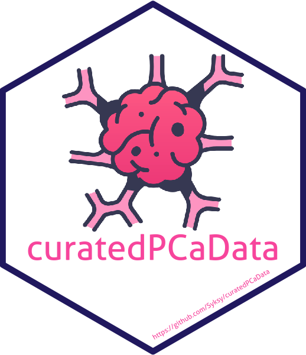

```{r setup, include = FALSE}
knitr::opts_chunk$set(
  collapse = TRUE,
  fig.path = "man/figures/README-",
  out.width = "100%"
)
```

# curatedPCaData 

<!-- badges: start -->
<!-- badges: end -->

## Overview 

`curatedPCaData` is a collection of publically available and annotated data resources
concerning prostate cancer. 

## Installation

You can install `curatedPCaData` from github with: 

```r

# install.packages("devtools")
devtools::install_github("Syksy/curatedPCaData")

```

<!--- add BioConductor once up --->

## Usage


```{r example_one, warning = FALSE, message = FALSE}

library(curatedPCaData)


curatedPCaData::mae_tcga

curatedPCaData::mae_tcga[["gex"]][1:4,1:4]
curatedPCaData::mae_tcga[["cna"]][1:4,1:4]
MultiAssayExperiment::colData(curatedPCaData::mae_tcga)[1:3,1:5]


curatedPCaData::mae_taylor
curatedPCaData::mae_sun

```

