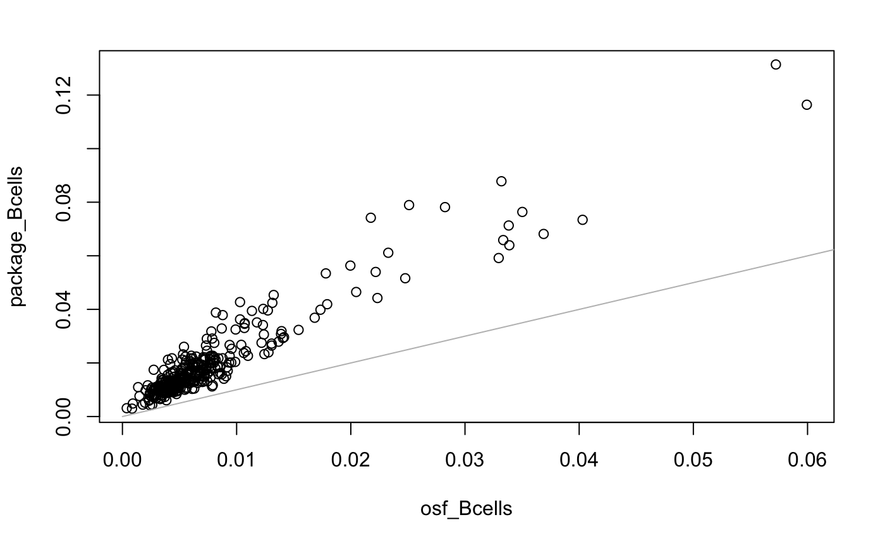
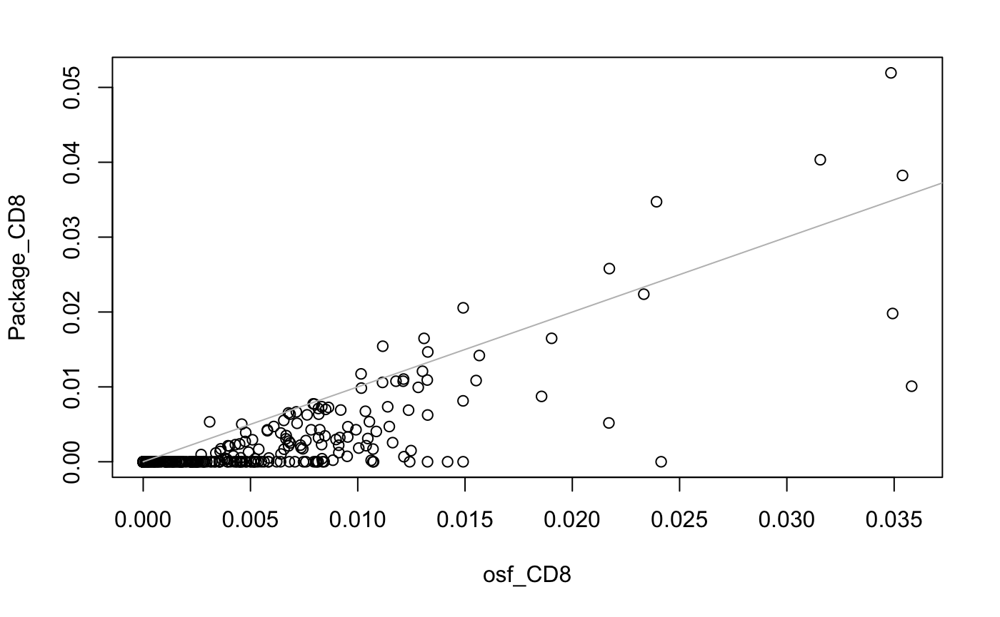
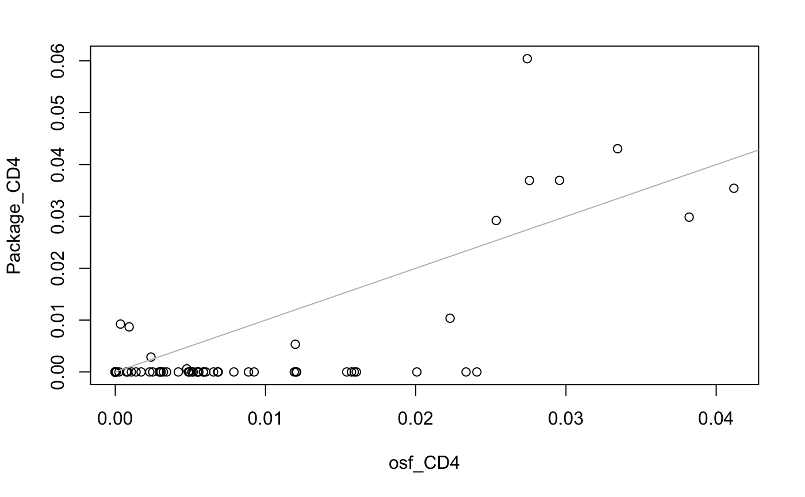
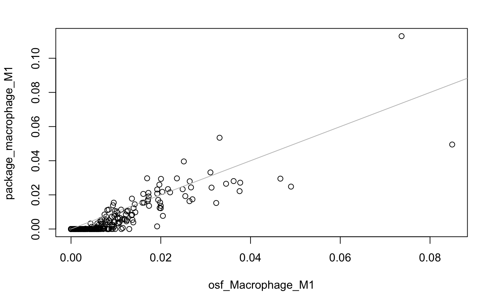
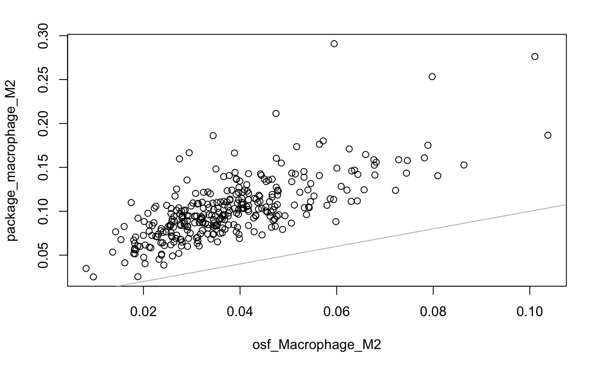
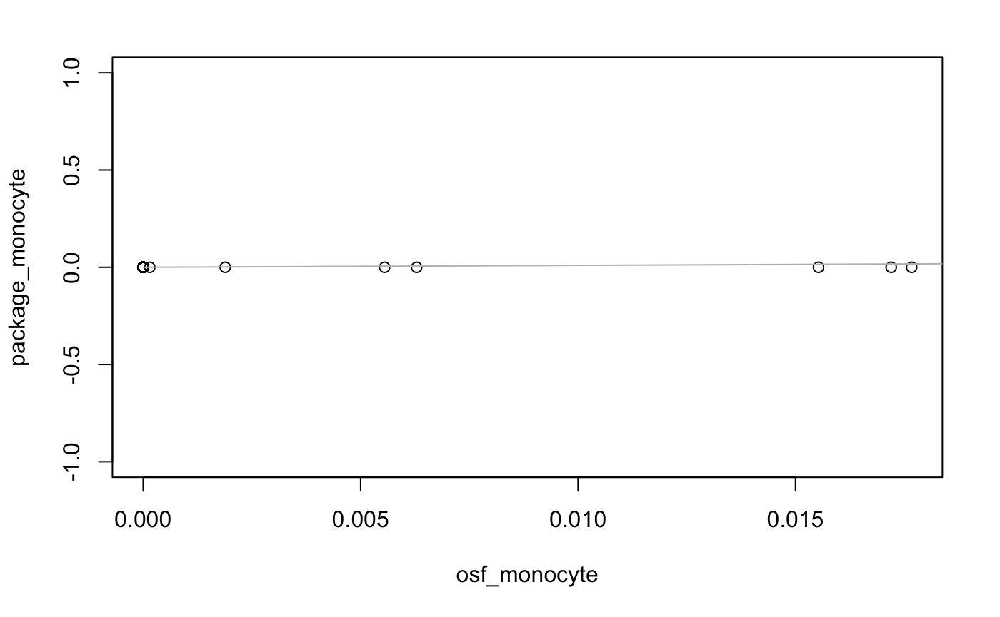
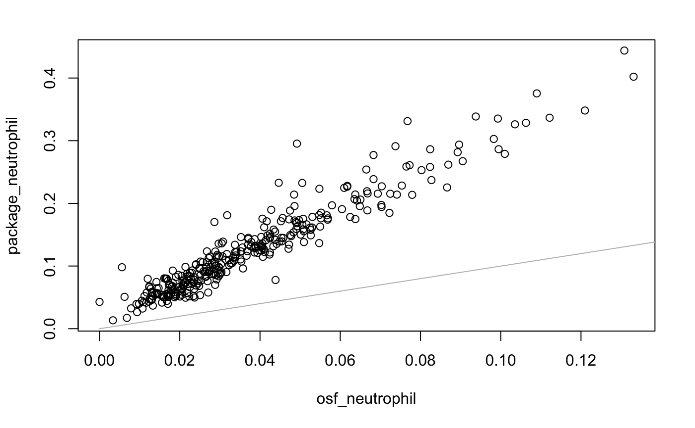
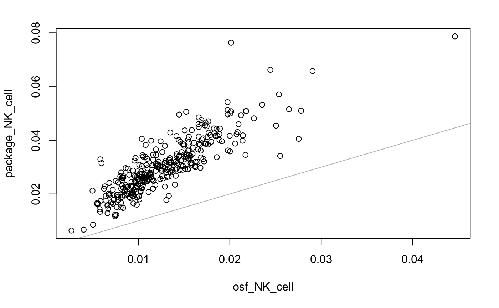
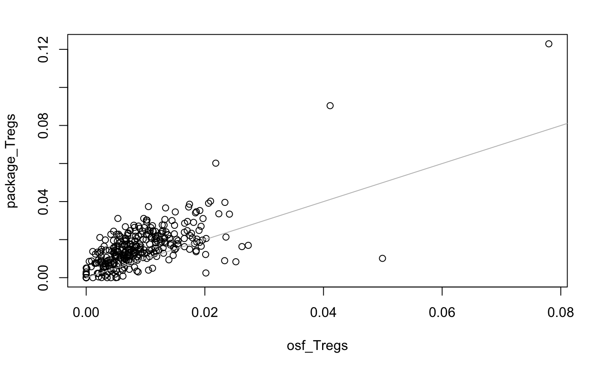
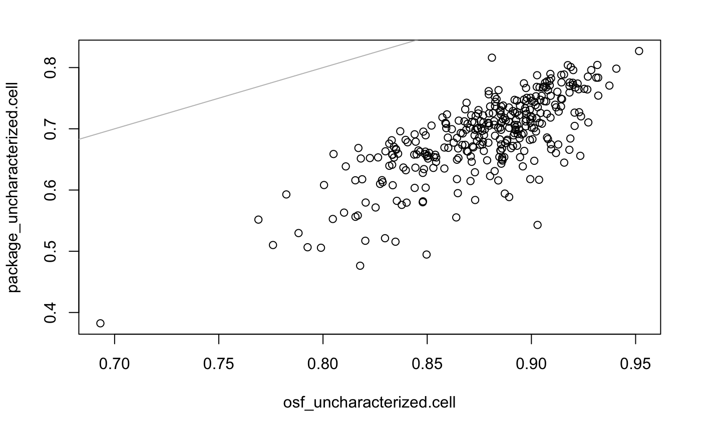

```{r, include = FALSE}
knitr::opts_chunk$set(
  collapse = TRUE,
  comment = "#>",
  warning = FALSE,
  message = FALSE,
  cache = TRUE
)
library(tidyverse)
library(viridis)
```


This vignette introduces `curatedPCaData` and provides an overview of the  package using data from TCGA as an example. 

***

3 different data types are currently available: 

1. `gex_*.RData` contains gene expression values
2. `cna_*.RData` contains copy number values
3. `clinical_*.RData` contains clinical/phenotype information
    
These elements are created with internal functions within `curatedPCaData` and are then used to derive additional measures, such as immune scores. 
Not all datasets will contain each of these elements but at  minimum will contain `clinical_*.rda` and `gex_*.rda`.

These individual elements are combined into a `MultiAssayExperiment object` (abbreviation: `MAE`, in lower case by convention) called `mae_*.rda`. 


## Introduction 

The `curatedPCaData` package contains a collection of manually curated datasets concerning patients diagnosed with prostate cancer. The datasets within this package have followed uniform processing and naming conventions to allow users to more easily reproduce similar analyses between datasets and spend less time concerned with harmonzing data from different resources. 

In this vignette, we will : 

1. Provide an introduction to `curatedPCaData`. 
2. Show how to run a simple analysis using the data 

## Importing data

The individual elements are housed within the `data-raw/` folder of the package [github repo](https://github.com/Syksy/curatedPCaData) and follows a simple naming convention of `data type` and `first author` separated by a `_` (see dataset types above). 
Each indivdual element for creating the final `MAE` were created using internal functions (accessible with `:::`).
A `MAE` for each study is provided to the users. 

To get a full list of available datasets use the `data` function:
```{r importing}
library(curatedPCaData)
data(package="curatedPCaData")
```

Individual datasets can also be imported by using the `data` function

```{r data-import}
data("mae_tcga")
mae_tcga
```
For more information on working with `mae`s please see the BioConductor `MutliAssayExperiment` package [documentation](https://bioconductor.org/packages/devel/bioc/vignettes/MultiAssayExperiment/inst/doc/QuickStartMultiAssay.html). 

## Example analysis

Daniel will put some text here about doing a simple analysis and perform an analysis here: 
  + survival analysis usinng alternative outcomes (BCR or mets)
  + use multiple datasets
  + example: http://www.bioconductor.org/packages/release/data/experiment/vignettes/curatedOvarianData/inst/doc/curatedOvarianData_vignette.pdf

```{r subset_data,eval=FALSE}
wide_tcga <- MultiAssayExperiment::wideFormat(mae_tcga["PTEN", , ],
    colDataCols=c("overall_survival_status", "days_to_overall_survival", "gleason_grade"))
summary(glm(days_to_overall_survival ~ GEX_PTEN + gleason_grade, data = wide_tcga))
```

## Immune deconvolution

Tumor progression depends on the immune cell composition in the tumor microenvironment. The '[immunedeconv](https://github.com/icbi-lab/immunedeconv)' package consists of different computational methods to computationally estimate immune cell content using gene expression data.

The deconvolution methods we use here are:

1. quantiseq
2. xcell
3. epic
4. mcp_counter

To run any deconvolution method with the default parameters, the following command can be used

```{r,eval=FALSE}
immunedeconv::deconvolute(gene_expression_matrix, method)
```

The rows of the gene expression matrix are HGNC gene symbols and the columns are the sample. Method can be one of them listed above.

For example, the following command can be used to run quantiseq over the TCGA GEX matrix in the package

```{r quantiseq}
library(immunedeconv)
gex_tcga <- curatedPCaData::mae_tcga[["gex"]]
immunedeconv::deconvolute(gex_tcga,"quantiseq")
```

Since the TCGA data in the package is median centered, we also provided a TPM normalized dataset for TCGA prostate cancer samples as a part of the TCGA MAE object. This is solely because the deconvolution methods ideally would require a TPM normalized input. We obtained the TPM normalized GEX data from the a consortium called the '[Open Science Framework (OSF)](https://osf.io/). 

For benchmarking, we compare the deconvolution results results between the data from the OSF repository with the median centred TCGA GEX data from cBioportal, by generating correlation plots.
The plots below show the comparison of immune cell propotions between TPM normalized data and the median centred TCGA data for every immune cell type generated by Quantiseq as an example. We observe a positive correlation between the results in most cell types.


```{r immunedeconv-plots, echo=FALSE}



knitr::include_graphics("vignette_plots/quantiseq_dendritic.png")









```


